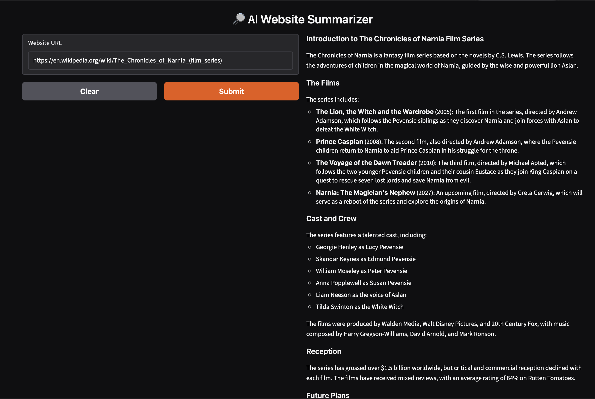

# AI Website Summarizer

An AI-powered web application that summarizes the content of any website using OpenAI's language models. Simply enter a website URL, and the application extracts the webpage content, processes it, and generates a concise summary.

## Features

- Summarize any publicly accessible website
- Clean and interactive web interface built with Gradio
- Automatically extracts webpage content
- AI-generated concise summaries
- Simple and easy to use

## Tech Stack

- Python
- OpenAI API
- Gradio
- BeautifulSoup
- Requests

## Project Structure

```
.
├── app.py
├── scraper.py
├── summarizer.py
├── README.md
├── requirements.txt
├── .env.example
└── .gitignore
```

## Installation

Clone the repository:

```bash
git clone https://github.com/ArjunNigam/AI-Website-Summarizer.git
cd AI-Website-Summarizer
```

Create a virtual environment:

```bash
python -m venv .venv
source .venv/bin/activate      # macOS/Linux
```

Install dependencies:

```bash
pip install -r requirements.txt
```

Create a `.env` file:

```env
OPENAI_API_KEY=your_api_key_here
```

Run the application:

```bash
python app.py
```

## Demo

### Application



## Future Improvements

- Support YouTube video summarization
- Export summaries as PDF
- Multiple summary lengths
- Multi-language summaries
- Streaming responses